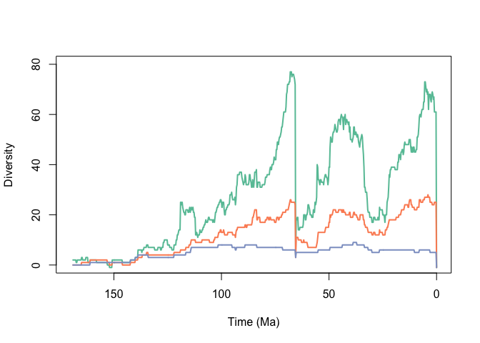
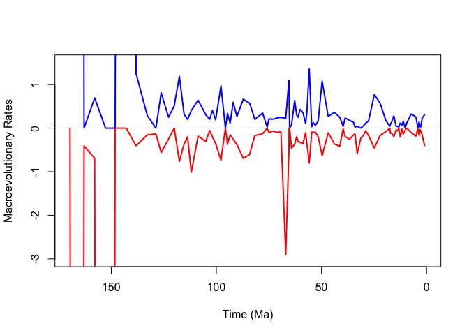

## Initial Dataset


```r
plot(0,0,
     type='n',
     xlim=c(170,0),
     #xlim=c(80,50),
     ylim=c(0,
            80),
     xlab='Time (Ma)',
     ylab="Diversity")
#axis(side=2,at=seq(0,800,by=5))
brewer.pal(n=8,name="Set2")->div.pallet
lines(time.div(test.complex.index,
               morph$origin,
               morph$extin,
               0.25),
      lwd=2,
      col=div.pallet[1])
lines(time.div(1:length(genus.dataframe$genus),
               genus.dataframe$origin,
               genus.dataframe$extin,
               0.25),
      lwd=2,
      col=div.pallet[2])
lines(time.div(1:length(family.dataframe$genus),
               family.dataframe$origin,
               family.dataframe$extin,
               0.25),
      lwd=2,
      col=div.pallet[3])
```

<!-- -->
Planktic foraminifera species level diversity curve. Probably won't keep the colorscheme.


```r
plot(0,0,
     type='n',
     xlim=c(170,0),
     #xlim=c(80,50),
     ylim=c(0,
            80),
     xlab='Time (Ma)',
     ylab="Diversity")
#axis(side=2,at=seq(0,800,by=5))
brewer.pal(n=8,name="Set2")->div.pallet
lines(time.div(test.complex.index,
               morph$origin,
               morph$extin,
               0.25),
      lwd=2,
      col=div.pallet[1])
lines(time.div(1:length(genus.dataframe$genus),
               genus.dataframe$origin,
               genus.dataframe$extin,
               0.25),
      lwd=2,
      col=div.pallet[2])
lines(time.div(1:length(family.dataframe$genus),
               family.dataframe$origin,
               family.dataframe$extin,
               0.25),
      lwd=2,
      col=div.pallet[3])
```

<!-- -->

