## Initial Dataset


```r
plot(0,0,
     type='n',
     xlim=c(170,0),
     #xlim=c(80,50),
     ylim=c(0,
            80),
     xlab='Time (Ma)',
     ylab="Diversity")
#axis(side=2,at=seq(0,800,by=5))
brewer.pal(n=8,name="Set2")->div.pallet
lines(time.div(test.complex.index,
               morph$origin,
               morph$extin,
               0.25),
      lwd=2,
      col=div.pallet[1])
lines(time.div(1:length(genus.dataframe$genus),
               genus.dataframe$origin,
               genus.dataframe$extin,
               0.25),
      lwd=2,
      col=div.pallet[2])
lines(time.div(1:length(family.dataframe$genus),
               family.dataframe$origin,
               family.dataframe$extin,
               0.25),
      lwd=2,
      col=div.pallet[3])
```

<!-- -->
Planktic foraminifera species level diversity curve. Probably won't keep the colorscheme.


```r
plot(0,0,
     type='n',
     xlim=c(170,0),
     #xlim=c(80,50),
     ylim=c(0,
            80),
     xlab='Time (Ma)',
     ylab="Diversity")
#axis(side=2,at=seq(0,800,by=5))
brewer.pal(n=8,name="Set2")->div.pallet
lines(time.div(test.complex.index,
               morph$origin,
               morph$extin,
               0.25),
      lwd=2,
      col=div.pallet[1])
lines(midstage,occurtot,col='black',lwd=2)
lines(time.div(1:length(genus.dataframe$genus),
               genus.dataframe$origin,
               genus.dataframe$extin,
               0.25),
      lwd=2,
      col=div.pallet[2])
lines(midstage,occurtot.genus,col='black',lwd=2)
lines(time.div(1:length(family.dataframe$genus),
               family.dataframe$origin,
               family.dataframe$extin,
               0.25),
      lwd=2,
      col=div.pallet[3])
lines(midstage,occurtot.family,col="black",lwd=2)
```

<!-- -->
The difference between the 0.25 myr binned and zone scheme binned are pretty stark. In most timeperiods the zonal scheme inflates the number of individuals. There are a few times that isn't hte case, the later part of the Cretaceous, the Danian, the latter stages of the Paleogene, and the later portion of the Miocene. This is much less the case for the genus, which appears much more stable. While this seems obvious, it's an important difference, and suggests that binning schemes are much more important in the lower taxonomic levels. 
A case certainly should be made that there are instances (Danian, for example) where the additional resolution is useful. Where doing a longer record however, the zone scheme is appropriate.

## Macrorates

```r
plot(0,0,
     type='n',
     xlim=c(170,0),
     ylim=c(-3,1.5),
     xlab='Time (Ma)',
     ylab="Macroevolutionary Rates")
lines(midstage,p,
      lwd=2,
      col='blue')
lines(midstage,-q,
      col='red',
      lwd=2)
abline(h=0,col='grey',lwd=.5)
```

<!-- -->

From Fraass et al. 2015. Needs to add the siginficant rates, but I think I can leave off the envelope. Do need to grab which zones that was from that paper... possibly by hand because of the fiddly nearly non-signficiant ones, just to be consistent. 


```r
inc<-c(#"w",
  #"mtheta",
  #"lw",
  #"lh",
  #"ic1",
  #"ic2",
  #"ic3",
  "fcirc",
  "t",
  "numcham",
  "expans",
  #"height",
  #"length",
  #"fcangle",
  "area",
  "fcarea",
  "clava",
  #"chamwl",
  "keel",
  #"bidors",
  #"biven",
  "biconvex",
  "lobe"
  #"double"
  #"depth"
)
inc2<-c(#"w",
  "mtheta",
  "lw",
  "lh",
  #"ic1",
  #"ic2",
  #"ic3",
  "fcirc",
  "t",
  "numcham",
  "expans",
  #"height",
  #"length",
  "fcangle",
  "area",
  #"fcarea",
  "clava",
  "chamwl",
  "keel",
  #"bidors",
  #"biven",
  "biconvex",
  "lobe",
  "double"
  #"depth"
)
pairs(morph[,inc],pch=16,cex=.4)  
```

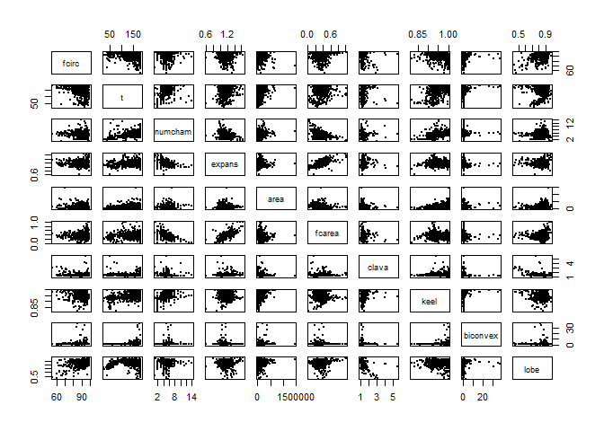<!-- -->

Plot of the included morphometric parameters. used to look for correlations, so that we can not include those. 


```r
foram.dataframe->morph
exclude<-c(4)
morph[1:length(morph[,1]) %w/o% exclude,]->morph
morph[which(is.na(rowSums(morph[,inc])) == F),13:36]->pca.in
decostand(pca.in[,inc],method='standardize',2)->pca.in
princomp(pca.in)->res.pca
plot(res.pca)
```

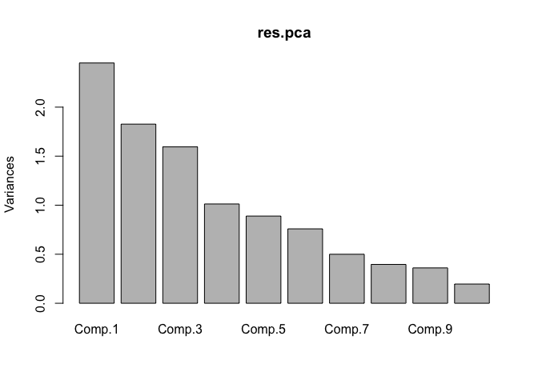<!-- -->

```r
 res.pca$sdev^2/sum(res.pca$sdev^2)->PoV
```
Results of the Principle Components Analysis (PCA). First, second, and third axes contain ~58.81% of the variance. 


```r
foram.dataframe->morph
exclude<-c(4)
morph[1:length(morph[,1]) %w/o% exclude,]->morph
morph[which(is.na(rowSums(morph[,inc2])) == F),13:36]->pca.in
decostand(pca.in[,inc2],method='standardize',2)->pca.in
princomp(pca.in)->res.pca2
plot(res.pca2)
```

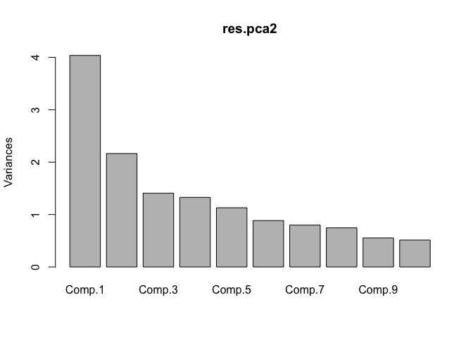<!-- -->

```r
 res.pca2$sdev^2/sum(res.pca2$sdev^2)->PoV2
```
Results of a second Principle Components Analysis (PCA) which includes all morphometric parameters. First, second, and third axes contain ~50.8% of the variance. 

```r
biplot(res.pca2)
```

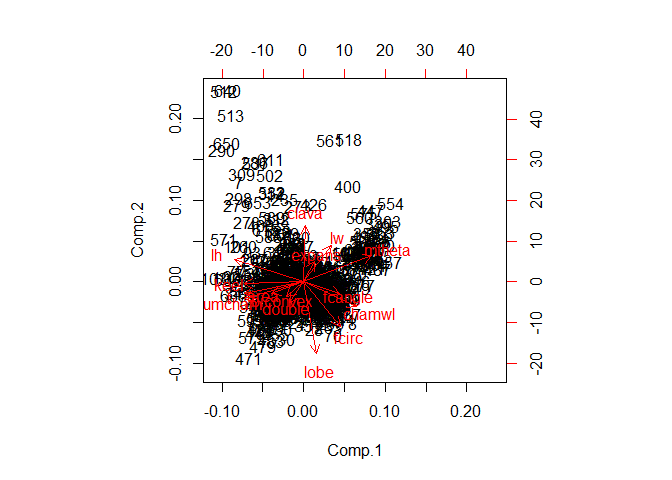<!-- -->
So, including targeted set lets us look at fewer components, with higher variance explained. The number of chamber parameters seem to dominate the first axis in the second kitchen-sink approach. That makes sense, since the number of chambers int he final whorl is dependent on the interchamber angle, which is then summarized by mtheta. So, mtheta, ic1:5 are all covarying, while number of chamber is placed at the other side. Axis two looks like it's size, (theres also some loading of size on A1). big keeled things v. others.

The thing I don't like is the scree plot isn't steep. The first has lots of variance spread out through the various axes. 

I think that actually makes sense. All of our measurements were designed to discriminate between the major groups, and be highly varying. Thus, because of the nature of our measruermnets the variance should be distributed because we did that on purpose. 

I kept twiddling with the knobs. I'm increasingly convinced that this dataset can't be looked at with a PCA becasue there's too much variance in too many different parameters. Like, I top out with the first-thrid axis explaining not-quite 60% of the variance. That's crap.

So, back to test complexity then.


## Test Complexity

```r
foram.dataframe->morph
 for(i in inc){
    decostand(morph[,i],method= 'standardize',margin=2,na.rm=T)->morph[,i]
   abs(morph[,i])->morph[,i]
  } #making each measurement set range from 0 to 1
  #rowSums(morph[,inc])/length(inc)->test.complex.index #creating a single value
  rowSums(morph[,inc])->test.complex.index
plot(0,0,
     type='n',
     xlim=c(170,0),
     #xlim=c(80,50),
     ylim=c(min(test.complex.index,na.rm=T),
            max(test.complex.index,na.rm=T)),
     xlab='Time (Ma)',
     ylab="Test Complexity")
segments(morph$origin,
         test.complex.index,
         morph$extin,
         test.complex.index)
```

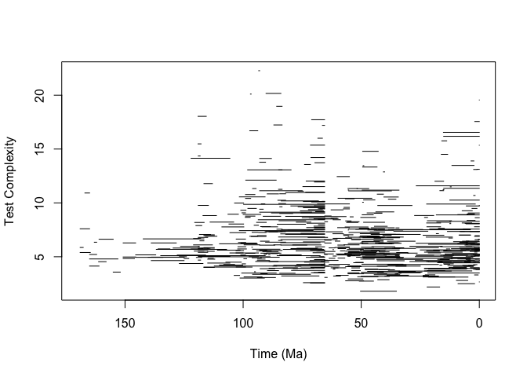<!-- -->
Test complexity is constructed by standardizing the values within each parameter (each parameter has a unit variance and mean of zero). Thus, the average morphological parameter (for example, number of chambers, mean = 0.7) is 0, while a higher number of chambers is a positive number, while a lower number of chambers is negative. The absolute values of the parameters are then summed together, to examine the deviations from an 'average' test, resulting in Figure TESTCOMPLEXITY. 


```r
time.var(test.complex.index,morph$origin,morph$extin,timeresolution.dataframe)->temp
plot(0,0,
     type='n',
     xlim=c(170,0),
     xlab="Time (Ma)",
     ylab="Variance of Test Complexity",
     ylim=c(min(temp[,2],na.rm=T),
            max(temp[,2],na.rm=T))
  )
  lines(temp[,1],temp[,2],lwd=4,col='blue')
  time.var(test.complex.index,morph$origin,morph$extin,.1)->temp
    lines(temp[,1],temp[,2],lwd=3,col='black')
  time.var(test.complex.index,morph$origin,morph$extin,.5)->temp
    lines(temp[,1],temp[,2],lwd=2,col='grey40')
      time.var(test.complex.index,morph$origin,morph$extin,1)->temp
    lines(temp[,1],temp[,2],lwd=2,col='grey60')
```

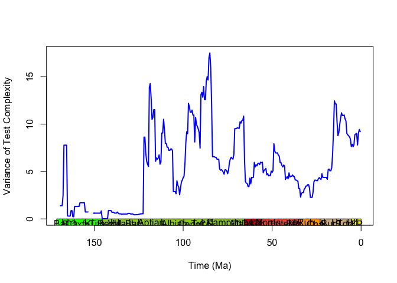<!-- -->

Trends in the variance are robust across different binning schemes, particularily in the Cenozoic. There appears to be no substantive difference between a biostratigraphic binning scheme (Fraass et al., 2015) or a million year binning scheme (0.1, 0.5, 1 myr tested).


```r
plot(p[1:84],time.var(test.complex.index,morph$origin,morph$extin,timeresolution.dataframe)[1:84,2],
     xlab="p",ylab="Variance in Test Complexity")
```

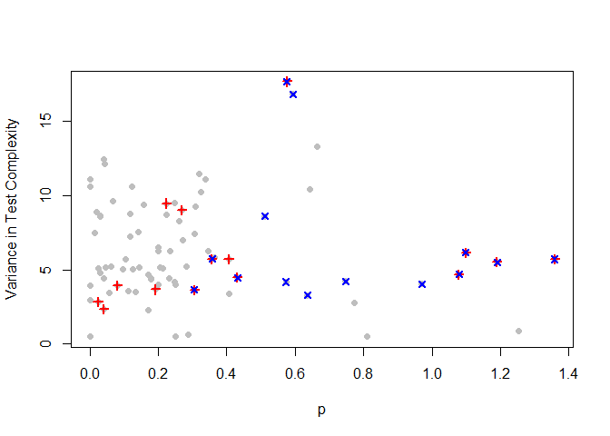<!-- -->

```r
cor.test(p[1:84],time.var(test.complex.index,morph$origin,morph$extin,timeresolution.dataframe)[1:84,2])
```

```
## 
## 	Pearson's product-moment correlation
## 
## data:  p[1:84] and time.var(test.complex.index, morph$origin, morph$extin, timeresolution.dataframe)[1:84, p[1:84] and     2]
## t = -0.52696, df = 82, p-value = 0.5996
## alternative hypothesis: true correlation is not equal to 0
## 95 percent confidence interval:
##  -0.2691373  0.1582722
## sample estimates:
##         cor 
## -0.05809431
```

```r
plot(q.family[1:84],time.var(test.complex.index,morph$origin,morph$extin,timeresolution.dataframe)[1:84,2],
     xlab="q",ylab="Variance in Test Complexity")
```

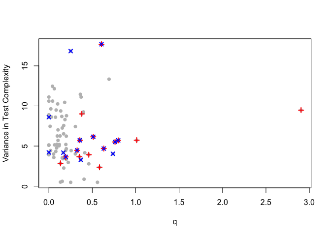<!-- -->

```r
cor.test(q[1:84],time.var(test.complex.index,morph$origin,morph$extin,timeresolution.dataframe)[1:84,2])
```

```
## 
## 	Pearson's product-moment correlation
## 
## data:  q[1:84] and time.var(test.complex.index, morph$origin, morph$extin, timeresolution.dataframe)[1:84, q[1:84] and     2]
## t = 0.43845, df = 82, p-value = 0.6622
## alternative hypothesis: true correlation is not equal to 0
## 95 percent confidence interval:
##  -0.1677727  0.2600608
## sample estimates:
##        cor 
## 0.04836204
```

```r
plot(p[1:83],diff(time.var(test.complex.index,morph$origin,morph$extin,timeresolution.dataframe)[1:84,2]),
     xlab="p(1)",ylab="first diff Variance in Test Complexity")
```

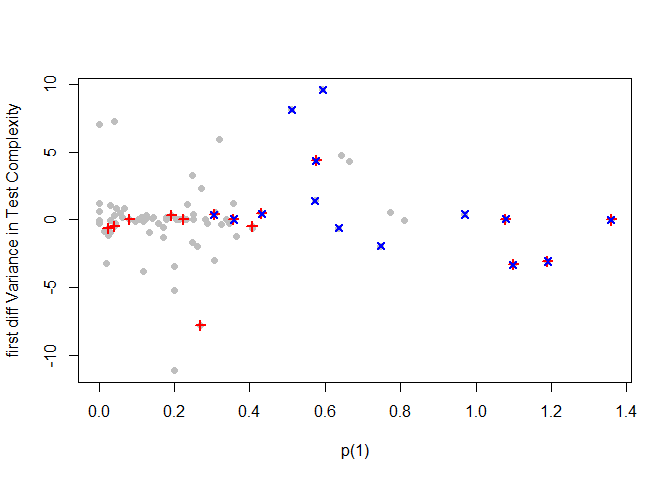<!-- -->

```r
cor.test(p[1:83],diff(time.var(test.complex.index,morph$origin,morph$extin,timeresolution.dataframe)[1:84,2]))
```

```
## 
## 	Pearson's product-moment correlation
## 
## data:  p[1:83] and diff(time.var(test.complex.index, morph$origin, morph$extin, p[1:83] and     timeresolution.dataframe)[1:84, 2])
## t = -0.41944, df = 81, p-value = 0.676
## alternative hypothesis: true correlation is not equal to 0
## 95 percent confidence interval:
##  -0.2596361  0.1708510
## sample estimates:
##         cor 
## -0.04655384
```

```r
plot(q[1:83],diff(time.var(test.complex.index,morph$origin,morph$extin,timeresolution.dataframe)[1:84,2]),
     xlab="q(1)",ylab="first diff Variance in Test Complexity")
```

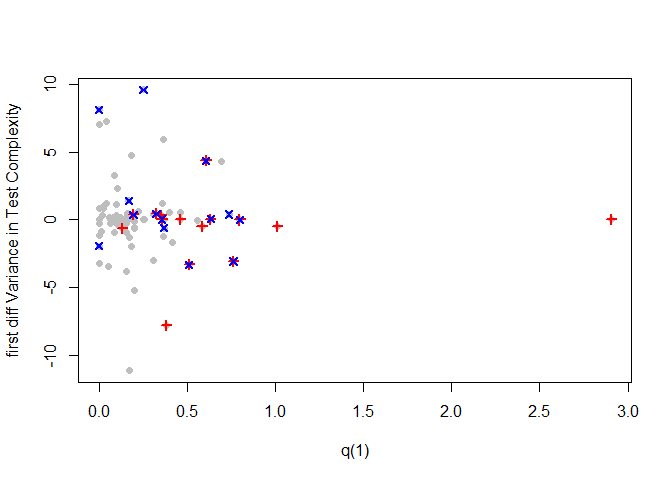<!-- -->

```r
cor.test(q[1:83],diff(time.var(test.complex.index,morph$origin,morph$extin,timeresolution.dataframe)[1:84,2]))
```

```
## 
## 	Pearson's product-moment correlation
## 
## data:  q[1:83] and diff(time.var(test.complex.index, morph$origin, morph$extin, q[1:83] and     timeresolution.dataframe)[1:84, 2])
## t = 0.33071, df = 81, p-value = 0.7417
## alternative hypothesis: true correlation is not equal to 0
## 95 percent confidence interval:
##  -0.1803971  0.2504268
## sample estimates:
##        cor 
## 0.03672097
```

```r
plot(p[2:84],diff(time.var(test.complex.index,morph$origin,morph$extin,timeresolution.dataframe)[1:84,2]),
     xlab="p(1)",ylab="first diff Variance in Test Complexity")
```

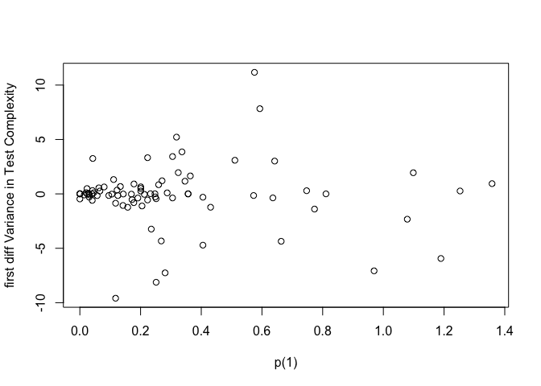<!-- -->

```r
cor.test(p[2:84],diff(time.var(test.complex.index,morph$origin,morph$extin,timeresolution.dataframe)[1:84,2]))
```

```
## 
## 	Pearson's product-moment correlation
## 
## data:  p[2:84] and diff(time.var(test.complex.index, morph$origin, morph$extin, p[2:84] and     timeresolution.dataframe)[1:84, 2])
## t = -0.35225, df = 81, p-value = 0.7256
## alternative hypothesis: true correlation is not equal to 0
## 95 percent confidence interval:
##  -0.2526665  0.1780829
## sample estimates:
##         cor 
## -0.03910853
```

```r
plot(q[2:84],diff(time.var(test.complex.index,morph$origin,morph$extin,timeresolution.dataframe)[1:84,2]),
     xlab="q(1)",ylab="first diff Variance in Test Complexity")
```

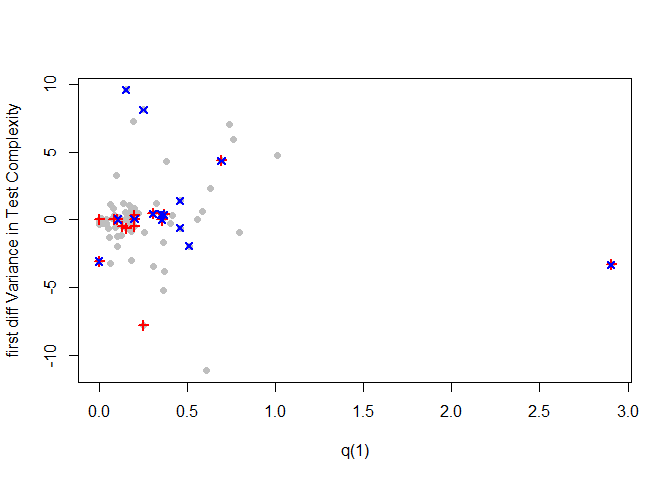<!-- -->

```r
cor.test(q[2:84],diff(time.var(test.complex.index,morph$origin,morph$extin,timeresolution.dataframe)[1:84,2]))
```

```
## 
## 	Pearson's product-moment correlation
## 
## data:  q[2:84] and diff(time.var(test.complex.index, morph$origin, morph$extin, q[2:84] and     timeresolution.dataframe)[1:84, 2])
## t = 0.088791, df = 81, p-value = 0.9295
## alternative hypothesis: true correlation is not equal to 0
## 95 percent confidence interval:
##  -0.2062630  0.2250755
## sample estimates:
##         cor 
## 0.009865135
```
There is no correlation between q or p in the variance in test complexity. Additionally, one might suspect that the change in variance (like the end Cretaceous) would be correlated with elevated p or q. This is not the case. Variance in test complexity is not synchronous with the macroevolutionary rates at the species-, genus-, or family-levels. p values are also crap.


```r
plot(occurtot[1:84],time.var(test.complex.index,morph$origin,morph$extin,timeresolution.dataframe)[1:84,2],
     xlab="diversity",ylab="Variance in Test Complexity")
```

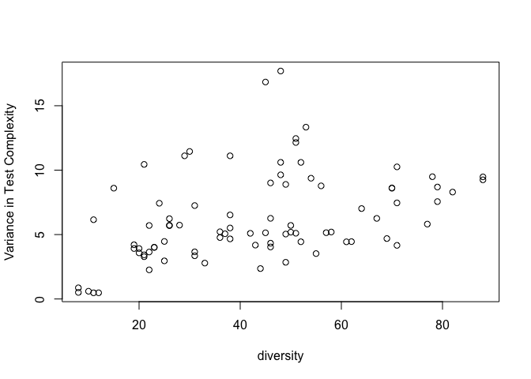<!-- -->

```r
cor.test(occurtot[1:84],time.var(test.complex.index,morph$origin,morph$extin,timeresolution.dataframe)[1:84,2])
```

```
## 
## 	Pearson's product-moment correlation
## 
## data:  occurtot[1:84] and time.var(test.complex.index, morph$origin, morph$extin, timeresolution.dataframe)[1:84, occurtot[1:84] and     2]
## t = 4.1454, df = 82, p-value = 8.216e-05
## alternative hypothesis: true correlation is not equal to 0
## 95 percent confidence interval:
##  0.2216222 0.5789680
## sample estimates:
##       cor 
## 0.4162398
```
Only valid correlation is diversity ~ variance, which is obvious because the diversity is _n_ in the calculation of the variance. Not terribly intersting. Higher diversity means slightly higher variance.


```r
time.var(test.complex.index,morph$origin,morph$extin,timeresolution.dataframe)->temp
plot(0,0,
     type='n',
     xlim=c(170,0),
     xlab="Time (Ma)",
     ylab="Variance of Test Complexity",
     ylim=c(min(temp[,2],na.rm=T),
            max(temp[,2],na.rm=T))
  )
  lines(temp[,1],temp[,2],lwd=3,col='blue')
lines(midstage,occurtot/5,col='black',lwd=2)
```

<!-- -->


```r
time.var(test.complex.index,morph$origin,morph$extin,timeresolution.dataframe)->temp
plot(timeresolution.dataframe[1:length(diff(temp[,1])),2],
        diff(temp[,2]),
     type='p',
     xlim=c(170,0),
     xlab="Time (Ma)",
     ylab="first diff Variance of Test Complexity",
     #ylim=c(-7,7),
     pch=16,
     col="green"
  )
  abline(v=c(23,34,55,65.5))
```

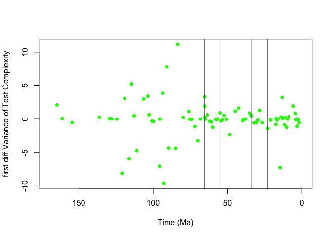<!-- -->


```r
time.var(test.complex.index,morph$origin,morph$extin,timeresolution.dataframe)->temp
plot(0,0,
     type='n',
     xlim=c(170,0),
     xlab="Time (Ma)",
     ylab="Variance of Test Complexity",
     ylim=c(min(temp[,2],na.rm=T),
            max(temp[,2],na.rm=T))
  )
  lines(temp[,1],temp[,2],lwd=3,col='blue')
lines(midstage,-q.genus*20+10,col='red',lwd=2)
abline()
```

<!-- -->
However, looking at individual timeperiods variance and extinction appear to be connected, most clearly at the genus level

