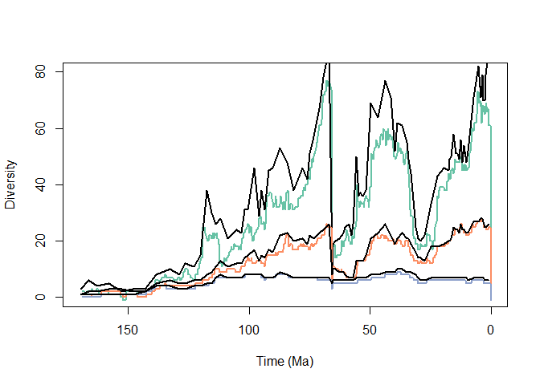

## Initial Dataset


```r
plot(0,0,
     type='n',
     xlim=c(170,0),
     #xlim=c(80,50),
     ylim=c(0,
            80),
     xlab='Time (Ma)',
     ylab="Diversity")
#axis(side=2,at=seq(0,800,by=5))
brewer.pal(n=8,name="Set2")->div.pallet
lines(time.div(test.complex.index,
               morph$origin,
               morph$extin,
               0.25),
      lwd=2,
      col=div.pallet[1])
lines(time.div(1:length(genus.dataframe$genus),
               genus.dataframe$origin,
               genus.dataframe$extin,
               0.25),
      lwd=2,
      col=div.pallet[2])
lines(time.div(1:length(family.dataframe$genus),
               family.dataframe$origin,
               family.dataframe$extin,
               0.25),
      lwd=2,
      col=div.pallet[3])
```

<!-- -->
Planktic foraminifera species level diversity curve. Probably won't keep the colorscheme.


```r
plot(0,0,
     type='n',
     xlim=c(170,0),
     #xlim=c(80,50),
     ylim=c(0,
            80),
     xlab='Time (Ma)',
     ylab="Diversity")
#axis(side=2,at=seq(0,800,by=5))
brewer.pal(n=8,name="Set2")->div.pallet
lines(time.div(test.complex.index,
               morph$origin,
               morph$extin,
               0.25),
      lwd=2,
      col=div.pallet[1])
lines(midstage,occurtot,col='black',lwd=2)
lines(time.div(1:length(genus.dataframe$genus),
               genus.dataframe$origin,
               genus.dataframe$extin,
               0.25),
      lwd=2,
      col=div.pallet[2])
lines(midstage,occurtot.genus,col='black',lwd=2)
lines(time.div(1:length(family.dataframe$genus),
               family.dataframe$origin,
               family.dataframe$extin,
               0.25),
      lwd=2,
      col=div.pallet[3])
lines(midstage,occurtot.family,col="black",lwd=2)
```

<!-- -->
The difference between the 0.25 myr binned and zone scheme binned are pretty stark. In most timeperiods the zonal scheme inflates the number of individuals. There are a few times that isn't hte case, the later part of the Cretaceous, the Danian, the latter stages of the Paleogene, and the later portion of the Miocene. This is much less the case for the genus, which appears much more stable. While this seems obvious, it's an important difference, and suggests that binning schemes are much more important in the lower taxonomic levels. 
A case certainly should be made that there are instances (Danian, for example) where the additional resolution is useful. Where doing a longer record however, the zone scheme is appropriate.

## Macrorates

```r
plot(0,0,
     type='n',
     xlim=c(170,0),
     ylim=c(-3,1.5),
     xlab='Time (Ma)',
     ylab="Macroevolutionary Rates")
lines(midstage,p,
      lwd=2,
      col='blue')
lines(midstage,-q,
      col='red',
      lwd=2)
abline(h=0,col='grey',lwd=.5)
```

<!-- -->

From Fraass et al. 2015. Needs to add the siginficant rates, but I think I can leave off the envelope. Do need to grab which zones that was from that paper... possibly by hand because of the fiddly nearly non-signficiant ones, just to be consistent. 


```r
inc<-c(#"w",
  #"mtheta",
  #"lw",
  #"lh",
  #"ic1",
  #"ic2",
  #"ic3",
  "fcirc",
  "t",
  "numcham",
  "expans",
  #"height",
  #"length",
  #"fcangle",
  "area",
  "fcarea",
  "clava",
  #"chamwl",
  "keel",
  #"bidors",
  #"biven",
  "biconvex",
  "lobe"
  #"double"
  #"depth"
)
inc2<-c(#"w",
  "mtheta",
  "lw",
  "lh",
  #"ic1",
  #"ic2",
  #"ic3",
  "fcirc",
  "t",
  "numcham",
  "expans",
  #"height",
  #"length",
  "fcangle",
  "area",
  #"fcarea",
  "clava",
  "chamwl",
  "keel",
  #"bidors",
  #"biven",
  "biconvex",
  "lobe",
  "double"
  #"depth"
)
pairs(morph[,inc],pch=16,cex=.4)  
```

<!-- -->

Plot of the included morphometric parameters. used to look for correlations, so that we can not include those. 


```r
foram.dataframe->morph
exclude<-c(4)
morph[1:length(morph[,1]) %w/o% exclude,]->morph
morph[which(is.na(rowSums(morph[,inc])) == F),13:36]->pca.in
decostand(pca.in[,inc],method='standardize',2)->pca.in
princomp(pca.in)->res.pca
plot(res.pca)
```

<!-- -->

```r
 res.pca$sdev^2/sum(res.pca$sdev^2)->PoV
```
Results of the Principle Components Analysis (PCA). First, second, and third axes contain ~58.81% of the variance. 


```r
foram.dataframe->morph
exclude<-c(4)
morph[1:length(morph[,1]) %w/o% exclude,]->morph
morph[which(is.na(rowSums(morph[,inc2])) == F),13:36]->pca.in
decostand(pca.in[,inc2],method='standardize',2)->pca.in
princomp(pca.in)->res.pca2
plot(res.pca2)
```

<!-- -->

```r
 res.pca2$sdev^2/sum(res.pca2$sdev^2)->PoV2
```
Results of a second Principle Components Analysis (PCA) which includes all morphometric parameters. First, second, and third axes contain ~50.8% of the variance. 

```r
biplot(res.pca2)
```

<!-- -->
So, including targeted set lets us look at fewer components, with higher variance explained. The number of chamber parameters seem to dominate the first axis in the second kitchen-sink approach. That makes sense, since the number of chambers int he final whorl is dependent on the interchamber angle, which is then summarized by mtheta. So, mtheta, ic1:5 are all covarying, while number of chamber is placed at the other side. Axis two looks like it's size, (theres also some loading of size on A1). big keeled things v. others.

The thing I don't like is the scree plot isn't steep. The first has lots of variance spread out through the various axes. 

I think that actually makes sense. All of our measurements were designed to discriminate between the major groups, and be highly varying. Thus, because of the nature of our measruermnets the variance should be distributed because we did that on purpose. 

I kept twiddling with the knobs. I'm increasingly convinced that this dataset can't be looked at with a PCA becasue there's too much variance in too many different parameters. Like, I top out with the first-thrid axis explaining not-quite 60% of the variance. That's crap.

So, back to test complexity then.


