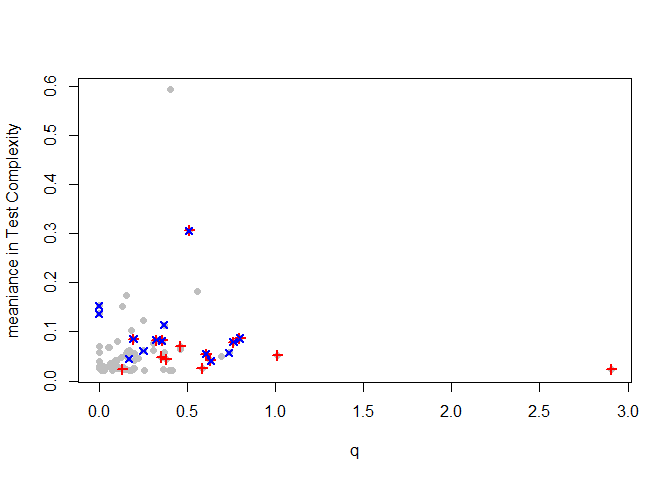

## Initial Dataset


```r
plot(0,0,
     type='n',
     xlim=c(170,0),
     #xlim=c(80,50),
     ylim=c(0,
            80),
     xlab='Time (Ma)',
     ylab="Diversity")
#axis(side=2,at=seq(0,800,by=5))
brewer.pal(n=8,name="Set2")->div.pallet
lines(time.div(test.complex.index,
               morph$origin,
               morph$extin,
               0.25),
      lwd=2,
      col=div.pallet[1])
lines(time.div(1:length(genus.dataframe$genus),
               genus.dataframe$origin,
               genus.dataframe$extin,
               0.25),
      lwd=2,
      col=div.pallet[2])
lines(time.div(1:length(family.dataframe$genus),
               family.dataframe$origin,
               family.dataframe$extin,
               0.25),
      lwd=2,
      col=div.pallet[3])
```

<!-- -->
Planktic foraminifera species level diversity curve. Probably won't keep the colorscheme.


```r
plot(0,0,
     type='n',
     xlim=c(170,0),
     #xlim=c(80,50),
     ylim=c(0,
            80),
     xlab='Time (Ma)',
     ylab="Diversity")
#axis(side=2,at=seq(0,800,by=5))
brewer.pal(n=8,name="Set2")->div.pallet
lines(time.div(test.complex.index,
               morph$origin,
               morph$extin,
               0.25),
      lwd=2,
      col=div.pallet[1])
lines(midstage,occurtot,col='black',lwd=2)
lines(time.div(1:length(genus.dataframe$genus),
               genus.dataframe$origin,
               genus.dataframe$extin,
               0.25),
      lwd=2,
      col=div.pallet[2])
lines(midstage,occurtot.genus,col='black',lwd=2)
lines(time.div(1:length(family.dataframe$genus),
               family.dataframe$origin,
               family.dataframe$extin,
               0.25),
      lwd=2,
      col=div.pallet[3])
lines(midstage,occurtot.family,col="black",lwd=2)
```

<!-- -->
The difference between the 0.25 myr binned and zone scheme binned are pretty stark. In most timeperiods the zonal scheme inflates the number of individuals. There are a few times that isn't hte case, the later part of the Cretaceous, the Danian, the latter stages of the Paleogene, and the later portion of the Miocene. This is much less the case for the genus, which appears much more stable. While this seems obvious, it's an important difference, and suggests that binning schemes are much more important in the lower taxonomic levels. 
A case certainly should be made that there are instances (Danian, for example) where the additional resolution is useful. Where doing a longer record however, the zone scheme is appropriate.

## Macrorates

```r
plot(0,0,
     type='n',
     xlim=c(170,0),
     ylim=c(-3,1.5),
     xlab='Time (Ma)',
     ylab="Macroevolutionary Rates")
lines(midstage,p,
      lwd=2,
      col='blue')
lines(midstage,-q,
      col='red',
      lwd=2)
abline(h=0,col='grey',lwd=.5)
```

<!-- -->

From Fraass et al. 2015. Needs to add the siginficant rates, but I think I can leave off the envelope. Do need to grab which zones that was from that paper... possibly by hand because of the fiddly nearly non-signficiant ones, just to be consistent. 


```r
inc<-c(#"w",
  #"mtheta",
  #"lw",
  #"lh",
  #"ic1",
  #"ic2",
  #"ic3",
  "fcirc",
  "t",
  "numcham",
  "expans",
  #"height",
  #"length",
  #"fcangle",
  "area",
  "fcarea",
  "clava",
  #"chamwl",
  "keel",
  #"bidors",
  #"biven",
  "biconvex",
  "lobe"
  #"double"
  #"depth"
)
inc2<-c(#"w",
  "mtheta",
  "lw",
  "lh",
  #"ic1",
  #"ic2",
  #"ic3",
  "fcirc",
  "t",
  "numcham",
  "expans",
  #"height",
  #"length",
  "fcangle",
  "area",
  #"fcarea",
  "clava",
  "chamwl",
  "keel",
  #"bidors",
  #"biven",
  "biconvex",
  "lobe",
  "double"
  #"depth"
)
pairs(morph[,inc],pch=16,cex=.4)  
```

<!-- -->

Plot of the included morphometric parameters. used to look for correlations, so that we can not include those. 


```r
foram.dataframe->morph
exclude<-c(4)
morph[1:length(morph[,1]) %w/o% exclude,]->morph
morph[which(is.na(rowSums(morph[,inc])) == F),13:36]->pca.in
decostand(pca.in[,inc],method='standardize',2)->pca.in
princomp(pca.in)->res.pca
plot(res.pca)
```

<!-- -->

```r
 res.pca$sdev^2/sum(res.pca$sdev^2)->PoV
```
Results of the Principle Components Analysis (PCA). First, second, and third axes contain ~58.81% of the variance. 


```r
foram.dataframe->morph
exclude<-c(4)
morph[1:length(morph[,1]) %w/o% exclude,]->morph
morph[which(is.na(rowSums(morph[,inc2])) == F),13:36]->pca.in
decostand(pca.in[,inc2],method='standardize',2)->pca.in
princomp(pca.in)->res.pca2
plot(res.pca2)
```

<!-- -->

```r
 res.pca2$sdev^2/sum(res.pca2$sdev^2)->PoV2
```
Results of a second Principle Components Analysis (PCA) which includes all morphometric parameters. First, second, and third axes contain ~50.8% of the variance. 

```r
biplot(res.pca2)
```

<!-- -->
So, including targeted set lets us look at fewer components, with higher variance explained. The number of chamber parameters seem to dominate the first axis in the second kitchen-sink approach. That makes sense, since the number of chambers int he final whorl is dependent on the interchamber angle, which is then summarized by mtheta. So, mtheta, ic1:5 are all covarying, while number of chamber is placed at the other side. Axis two looks like it's size, (theres also some loading of size on A1). big keeled things v. others.

The thing I don't like is the scree plot isn't steep. The first has lots of variance spread out through the various axes. 

I think that actually makes sense. All of our measurements were designed to discriminate between the major groups, and be highly varying. Thus, because of the nature of our measruermnets the variance should be distributed because we did that on purpose. 

I kept twiddling with the knobs. I'm increasingly convinced that this dataset can't be looked at with a PCA becasue there's too much variance in too many different parameters. Like, I top out with the first-thrid axis explaining not-quite 60% of the variance. That's crap.

So, back to test complexity then.


## Test Complexity

```r
inc<-c(#"w",
  #"mtheta",
  #"lw",
  #"lh",
  #"ic1",
  #"ic2",
  #"ic3",
  "fcirc",
  "t",
  "numcham",
  "expans",
  #"height",
  #"length",
  #"fcangle",
  "area",
  "fcarea",
  "clava",
  #"chamwl",
  "keel",
  #"bidors",
  #"biven",
  "biconvex",
  "lobe"
  #"double"
  #"depth"
)
pairs(morph[,inc],pch=16,cex=.4)  
```

<!-- -->

```r
which(morph$species == "holmdelensis")->h
which(morph$species == "monmouthensis")->m
build.tci<-morph
for(i in inc){
  {morph[h,i]+morph[m,i]}/2->simple.value
  build.tci[,i]<-morph[,i]-simple.value
}
plot(0,0,
     type='n',
     xlim=c(170,0),
     ylim=c(min(build.tci$fcarea,na.rm=T),
            max(build.tci$fcarea,na.rm=T)),
     xlab='Time (Ma)',
     ylab="fcarea minus simple")
segments(build.tci$origin,
         build.tci$fcarea,
         build.tci$extin,
         build.tci$fcarea)
```

<!-- -->
So here's a plot showing the a issue with picking one end. there are changes in the final chamber area/test area that are highly different from Meso->Ceno. Which is odd, but it's probably hte orbulinids and others like it.Either way, our assigned simple bugs are smack in the middle. Neat how it drifts one direction and the next.


```r
for(i in inc){
  abs(build.tci[,i])->build.tci[,i]#taking the absolute value
  decostand(build.tci[,i],method='range',na.rm=TRUE)->build.tci[,i]
}
test.complex.index<-NA
for(i in 1:length(build.tci$species)){
  sum(build.tci[i,inc])->test.complex.index[i]
}
plot(0,0,
     type='n',
     xlim=c(170,0),
     ylim=c(min(test.complex.index,na.rm=T),
            max(test.complex.index,na.rm=T)),
     xlab='Time (Ma)',
     ylab="test.complex.index")
segments(build.tci$origin,
         test.complex.index,
         build.tci$extin,
         test.complex.index)
```

<!-- -->

```r
#highlighting significant macroevolutionary events
which(timeresolution.dataframe$sig.origin == 'y')->sig.origin
which(timeresolution.dataframe$sig.extin == 'y')->sig.extin
```
Test complexity is constructed by standardizing the values within each parameter (each parameter has a unit variance and mean of zero). Thus, the average morphological parameter (for example, number of chambers, mean = 4.8) is 0, while a higher number of chambers is a positive number, while a lower number of chambers is negative. The absolute values of the parameters are then summed together, to examine the deviations from an 'average' test, resulting in Figure TESTCOMPLEXITY. 


```r
morph$family->family.ID
range.line.plot(test.complex.index,
                "Test Complexity Index",
                family.ID,
                morph$origin,
                morph$extin
                )
lines(time.mean(test.complex.index,morph$origin,morph$extin,1),lwd=2)
lines(time.median(test.complex.index,morph$origin,morph$extin,1),lwd=2,col="red")
```

<!-- -->

```r
  time.var(test.complex.index,morph$origin,morph$extin,1)->temp
```


```r
time.mean(test.complex.index,morph$origin,morph$extin,timeresolution.dataframe)->temp
plot(0,0,
     type='n',
     xlim=c(170,0),
     xlab="Time (Ma)",
     ylab="meaniance of Test Complexity",
     ylim=c(.75,
            1.75)
  )
  lines(temp[,1],temp[,2],lwd=4,col='blue')
  time.mean(test.complex.index,morph$origin,morph$extin,.1)->temp
    lines(temp[,1],temp[,2],lwd=3,col='black')
  time.mean(test.complex.index,morph$origin,morph$extin,.5)->temp
    lines(temp[,1],temp[,2],lwd=2,col='grey40')
      time.mean(test.complex.index,morph$origin,morph$extin,1)->temp
    lines(temp[,1],temp[,2],lwd=1,col='grey60')
```

<!-- -->

Trends in the variance are robust across different binning schemes, particularily in the Cenozoic. There appears to be no substantive difference between a biostratigraphic binning scheme (Fraass et al., 2015) or a million year binning scheme (0.1, 0.5, 1 myr tested).


```r
time.mean(test.complex.index,morph$origin,morph$extin,timeresolution.dataframe)[1:84,2]->t.mean
-diff(time.mean(test.complex.index,morph$origin,morph$extin,timeresolution.dataframe)[1:84,2])->d.t.mean

plot(p[1:84],t.mean,
     xlab="p",ylab="meaniance in Test Complexity",pch=16,col="grey")
cor.test(p[1:84],t.mean)
```

```
## 
## 	Pearson's product-moment correlation
## 
## data:  p[1:84] and t.mean
## t = 0.024238, df = 82, p-value = 0.9807
## alternative hypothesis: true correlation is not equal to 0
## 95 percent confidence interval:
##  -0.2118401  0.2169473
## sample estimates:
##         cor 
## 0.002676636
```

```r
points(p[sig.extin],t.mean[sig.extin],pch=3,lwd=2,col='red')
points(p[sig.origin],t.mean[sig.origin],pch=4,lwd=2,col='blue')
```

<!-- -->

```r
plot(q[1:84],t.mean,
     xlab="q",ylab="meaniance in Test Complexity",pch=16,col="grey")
cor.test(q[1:84],t.mean)
```

```
## 
## 	Pearson's product-moment correlation
## 
## data:  q[1:84] and t.mean
## t = 1.7564, df = 82, p-value = 0.08276
## alternative hypothesis: true correlation is not equal to 0
## 95 percent confidence interval:
##  -0.02500371  0.38892993
## sample estimates:
##       cor 
## 0.1904122
```

```r
points(q[sig.extin],t.mean[sig.extin],pch=3,lwd=2,col='red')
points(q[sig.origin],t.mean[sig.origin],pch=4,lwd=2,col='blue')
```

<!-- -->

```r
plot(p[1:83],d.t.mean,
     xlab="p(1)",ylab="first diff meaniance in Test Complexity",pch=16,col="grey")
cor.test(p[1:83],d.t.mean)
```

```
## 
## 	Pearson's product-moment correlation
## 
## data:  p[1:83] and d.t.mean
## t = -1.3128, df = 81, p-value = 0.193
## alternative hypothesis: true correlation is not equal to 0
## 95 percent confidence interval:
##  -0.34915409  0.07364761
## sample estimates:
##        cor 
## -0.1443344
```

```r
points(p[sig.extin],d.t.mean[sig.extin],pch=3,lwd=2,col='red')
points(p[sig.origin],d.t.mean[sig.origin],pch=4,lwd=2,col='blue')
```

<!-- -->

```r
plot(q[1:83],d.t.mean,
     xlab="q(1)",ylab="first diff meaniance in Test Complexity",pch=16,col="grey")
cor.test(q[1:83],d.t.mean)
```

```
## 
## 	Pearson's product-moment correlation
## 
## data:  q[1:83] and d.t.mean
## t = -0.16024, df = 81, p-value = 0.8731
## alternative hypothesis: true correlation is not equal to 0
## 95 percent confidence interval:
##  -0.2325982  0.1986500
## sample estimates:
##         cor 
## -0.01780205
```

```r
points(q[sig.extin],d.t.mean[sig.extin],pch=3,lwd=2,col='red')
points(q[sig.origin],d.t.mean[sig.origin],pch=4,lwd=2,col='blue')
```

<!-- -->

```r
plot(p[2:84],d.t.mean,
     xlab="p(1)",ylab="first diff meaniance in Test Complexity",pch=16,col="grey")
cor.test(p[2:84],d.t.mean)
```

```
## 
## 	Pearson's product-moment correlation
## 
## data:  p[2:84] and d.t.mean
## t = -0.34704, df = 81, p-value = 0.7295
## alternative hypothesis: true correlation is not equal to 0
## 95 percent confidence interval:
##  -0.2521251  0.1786428
## sample estimates:
##         cor 
## -0.03853117
```

```r
points(p[sig.extin+1],d.t.mean[sig.extin],pch=3,lwd=2,col='red')
points(p[sig.origin+1],d.t.mean[sig.origin],pch=4,lwd=2,col='blue')
```

<!-- -->

```r
plot(q[2:84],d.t.mean,
     xlab="q(1)",ylab="first diff meaniance in Test Complexity",pch=16,col="grey")
cor.test(q[2:84],d.t.mean)
```

```
## 
## 	Pearson's product-moment correlation
## 
## data:  q[2:84] and d.t.mean
## t = -4.9571, df = 81, p-value = 3.862e-06
## alternative hypothesis: true correlation is not equal to 0
## 95 percent confidence interval:
##  -0.6323408 -0.2977471
## sample estimates:
##        cor 
## -0.4824528
```

```r
points(q[sig.extin+1],d.t.mean[sig.extin],pch=3,lwd=2,col='red')
points(q[sig.origin+1],d.t.mean[sig.origin],pch=4,lwd=2,col='blue')
```

<!-- -->
There is no correlation between q or p in the variance in test complexity. Additionally, one might suspect that the change in variance (like the end Cretaceous) would be correlated with elevated p or q. This is not the case. Variance in test complexity is not synchronous with the macroevolutionary rates at the species-, genus-, or family-levels. p values are also crap.


```r
plot(occurtot[1:84],time.mean(test.complex.index,morph$origin,morph$extin,timeresolution.dataframe)[1:84,2],
     xlab="diversity",ylab="meaniance in Test Complexity")
```

<!-- -->

```r
cor.test(occurtot[1:84],time.mean(test.complex.index,morph$origin,morph$extin,timeresolution.dataframe)[1:84,2])
```

```
## 
## 	Pearson's product-moment correlation
## 
## data:  occurtot[1:84] and time.mean(test.complex.index, morph$origin, morph$extin, timeresolution.dataframe)[1:84, occurtot[1:84] and     2]
## t = 3.8263, df = 82, p-value = 0.000253
## alternative hypothesis: true correlation is not equal to 0
## 95 percent confidence interval:
##  0.1907441 0.5571266
## sample estimates:
##       cor 
## 0.3892222
```
Only valid correlation is diversity ~ variance, which is obvious because the diversity is _n_ in the calculation of the variance. Not terribly intersting. Higher diversity means slightly higher variance.


```r
time.mean(test.complex.index,morph$origin,morph$extin,timeresolution.dataframe)->temp
plot(0,0,
     type='n',
     xlim=c(170,0),
     xlab="Time (Ma)",
     ylab="meaniance of Test Complexity",
     ylim=c(min(temp[,2],na.rm=T),
            max(temp[,2],na.rm=T))
  )
  lines(temp[,1],temp[,2],lwd=3,col='grey')
lines(midstage,occurtot/5,col='grey70',lwd=1)
which(timeresolution.dataframe$sig.origin == 'y')->sig.origin
which(timeresolution.dataframe$sig.extin == 'y')->sig.extin

points(temp[sig.extin,1],temp[sig.extin,2],pch=3,lwd=2,col='red')
points(temp[sig.origin,1],temp[sig.origin,2],pch=4,lwd=2,col='blue')
```

<!-- -->


```r
time.mean(test.complex.index,morph$origin,morph$extin,timeresolution.dataframe)->tci.mean

plot(timeresolution.dataframe[1:length(diff(tci.mean[,1])),2],
        -diff(tci.mean[,2]),
     type='p',
     xlim=c(170,0),
     xlab="Time (Ma)",
     ylab="First Diff. of TCI meaniance",
     #ylim=c(-7,7),
     pch=16,
     col="grey"
  )

points(timeresolution.dataframe[1:length(diff(tci.mean[,1])),2][sig.extin],
       -diff(tci.mean[,2])[sig.extin],pch=3,lwd=2,col='red')
rug(-mean(diff(tci.mean[,2])[sig.extin]),col='red',lwd=4,side=2)
points(timeresolution.dataframe[1:length(diff(tci.mean[,1])),2][sig.origin],
       -diff(tci.mean[,2])[sig.origin],pch=4,lwd=2,col='blue')
rug(mean(-diff(tci.mean[,2])[sig.origin]),col='blue',side=2,lwd=4)
abline(h=0)
abline(v=65.5)
```

<!-- -->

```r
time.var(test.complex.index,morph$origin,morph$extin,timeresolution.dataframe)->tci.var
```
mean change of variance at sig extinction -0.0322539
mean change of meaniance at sig origination 0.0056479

Variance (or its first difference) are uncorrelated to macroevolutionary rates at any taxonomic level. There are, however, indiviudal genus-level extinction rates which appear to connect strongly with substantial drops in variance (~112 Ma, the Aptian Albian boundary, for example).


```r
time.mean(test.complex.index,morph$origin,morph$extin,timeresolution.dataframe)->temp
time.div(test.complex.index,morph$origin,morph$extin,timeresolution.dataframe)->temp.div
plot(0,0,
     type='n',
     xlim=c(170,0),
     xlab="Time (Ma)",
     ylab="Mean TCI/Diversity",
     ylim=c(0.02,
            .15)
  )
  lines(temp[,1],temp[,2]/temp.div[,2],lwd=3,col='grey')
which(timeresolution.dataframe$sig.origin == 'y')->sig.origin
which(timeresolution.dataframe$sig.extin == 'y')->sig.extin

points(temp[sig.extin,1],temp[sig.extin,2]/temp.div[sig.extin,2],pch=3,lwd=2,col='red')
points(temp[sig.origin,1],temp[sig.origin,2]/temp.div[sig.origin,2],pch=4,lwd=2,col='blue')
```

<!-- -->


```r
time.mean(test.complex.index,morph$origin,morph$extin,timeresolution.dataframe)[,2]->t.mean
time.div(test.complex.index,morph$origin,morph$extin,timeresolution.dataframe)[,2]->t.div
plot(p[1:84],t.mean[1:84]/t.div[1:84],
     xlab="p",ylab="meaniance in Test Complexity",pch=16,col="grey")
cor.test(p[1:84],t.mean[1:84]/t.div[1:84])
```

```
## 
## 	Pearson's product-moment correlation
## 
## data:  p[1:84] and t.mean[1:84]/t.div[1:84]
## t = 6.005, df = 82, p-value = 5.015e-08
## alternative hypothesis: true correlation is not equal to 0
## 95 percent confidence interval:
##  0.3837414 0.6858023
## sample estimates:
##       cor 
## 0.5526673
```

```r
points(p[sig.extin],t.mean[sig.extin]/t.div[sig.extin],pch=3,lwd=2,col='red')
points(p[sig.origin],t.mean[sig.origin]/t.div[sig.origin],pch=4,lwd=2,col='blue')
```

<!-- -->

```r
plot(q[1:84],t.mean[1:84]/t.div[1:84],
     xlab="q",ylab="meaniance in Test Complexity",pch=16,col="grey")
cor.test(q[1:84],t.mean[1:84]/t.div[1:84])
```

```
## 
## 	Pearson's product-moment correlation
## 
## data:  q[1:84] and t.mean[1:84]/t.div[1:84]
## t = 0.69476, df = 82, p-value = 0.4892
## alternative hypothesis: true correlation is not equal to 0
## 95 percent confidence interval:
##  -0.1401961  0.2861997
## sample estimates:
##       cor 
## 0.0764984
```

```r
points(q[sig.extin],t.mean[sig.extin]/t.div[sig.extin],pch=3,lwd=2,col='red')
points(q[sig.origin],t.mean[sig.origin]/t.div[sig.origin],pch=4,lwd=2,col='blue')
```

<!-- -->

```r
diff(t.mean[1:84]/t.div[1:84])->dif.tcidiv
plot(p[2:84],dif.tcidiv,
     xlab="p",ylab="meaniance in Test Complexity",pch=16,col="grey")
cor.test(p[2:84],dif.tcidiv)
```

```
## 
## 	Pearson's product-moment correlation
## 
## data:  p[2:84] and dif.tcidiv
## t = 5.1765, df = 81, p-value = 1.611e-06
## alternative hypothesis: true correlation is not equal to 0
## 95 percent confidence interval:
##  0.316981 0.644918
## sample estimates:
##       cor 
## 0.4985825
```

```r
points(p[sig.extin],dif.tcidiv[sig.extin-1],pch=3,lwd=2,col='red')
points(p[sig.origin],dif.tcidiv[sig.origin-1],pch=4,lwd=2,col='blue')
```

<!-- -->

```r
plot(q[2:84],dif.tcidiv,
     xlab="q",ylab="meaniance in Test Complexity",pch=16,col="grey"
     #,xlim=c(0,1),ylim=c(-.1,.4)
     )
cor.test(q[2:84],dif.tcidiv)
```

```
## 
## 	Pearson's product-moment correlation
## 
## data:  q[2:84] and dif.tcidiv
## t = -3.6964, df = 81, p-value = 0.0003963
## alternative hypothesis: true correlation is not equal to 0
## 95 percent confidence interval:
##  -0.5504950 -0.1788844
## sample estimates:
##        cor 
## -0.3799153
```

```r
points(q[sig.extin],dif.tcidiv[sig.extin-1],pch=3,lwd=2,col='red')
points(q[sig.origin],dif.tcidiv[sig.origin-1],pch=4,lwd=2,col='blue')
```

<!-- -->


```r
#building randomization process

  #first build was the wrong question. The question is given the 
  #underlying change is species, is the gain/loss in variance expected?
iterations<-10000
rand.var<-matrix(data=NA,
                 ncol=iterations,
                 nrow=length(timeresolution.dataframe$end))
rand.test.complex.index<-NA
for(i in 1:iterations){
    sample(test.complex.index,
           size=length(morph$origin),
           replace=FALSE)->rand.test.complex.index
  time.var(rand.test.complex.index, #importantly, the TCI scores don't change, so no need to recalculate these
           morph$origin,
           morph$extin,
           timeresolution.dataframe)[,2]->rand.var[,i]
  #print(i)
}
plot(timeresolution.dataframe$X,rand.var[,1],
     type='l',
     xlim=c(170,0),
     lwd=.1
)
for(i in 1:iterations){
  lines(timeresolution.dataframe$X,rand.var[,i],lwd=.1)
}
```

<!-- -->

```r
#forming the quantiles
high.var<-NA
low.var<-NA
for(i in 1:length(timeresolution.dataframe$X)){
  quantile(rand.var[i,],probs=.95,na.rm=T)->high.var[i]
  quantile(rand.var[i,],probs=.05,na.rm=T)->low.var[i]
}

plot(timeresolution.dataframe$X,
     tci.var[,2],
     type='l',
     xlim=c(170,0),
     xlab="Time (Ma)",
     ylab="TCI Variance",
     #ylim=c(-7,7),
     lwd=2,
     col="grey"
)
lines(timeresolution.dataframe$X,high.var)
lines(timeresolution.dataframe$X,low.var)
points(timeresolution.dataframe$X[sig.extin],tci.var[sig.extin,2],pch=3,lwd=2,col='red')
points(timeresolution.dataframe$X[sig.origin],tci.var[sig.origin,2],pch=4,lwd=2,col='blue')
abline(v=25)
```

<!-- -->
This plot is the result of a Monte Carlo analysis examining what a significantly high or low variance is. The bounds are the 90% limits of a randomizing the morphologies, but keeping the diversity pattern stable. This shows that there is more variance than a null model a the Santonian, and less through the ~42 Ma to ~25 Ma, much of the later Eocene and Oligocene. This matches qualitative assessments of the Oligocene. The Eocene, however, is usually described as an interval of high diversity, and this prolonged decrease is 


```r
dif.rand.var<-rand.var[1:{length(rand.var[,1])-1},]
for(i in 1:iterations){
  diff(rand.var[,i])->dif.rand.var[,i]
}
high.dif.var<-NA
low.dif.var<-NA
for(i in 1:length(dif.rand.var[,1])){
  quantile(dif.rand.var[i,],probs=.95,na.rm=T)->high.dif.var[i]
  quantile(dif.rand.var[i,],probs=.05,na.rm=T)->low.dif.var[i]
}

plot(timeresolution.dataframe[1:length(diff(tci.var[,1])),3],
        -diff(tci.var[,2]),
     type='p',
     xlim=c(170,0),
     xlab="Time (Ma)",
     ylab="First Diff. of TCI Variance",
     #ylim=c(-7,7),
     pch=16,
     col="grey"
  )

points(timeresolution.dataframe[1:length(diff(tci.var[,1])),3][sig.extin],
       -diff(tci.var[,2])[sig.extin],pch=3,lwd=2,col='red')
rug(-mean(diff(tci.var[,2])[sig.extin]),col='red',lwd=4,side=2)
points(timeresolution.dataframe[1:length(diff(tci.var[,1])),3][sig.origin],
       -diff(tci.var[,2])[sig.origin],pch=4,lwd=2,col='blue')
rug(mean(-diff(tci.var[,2])[sig.origin]),col='blue',side=2,lwd=4)
abline(h=0)
abline(v=65.5)
lines(timeresolution.dataframe[1:length(diff(tci.var[,1])),3],high.dif.var)
lines(timeresolution.dataframe[1:length(diff(tci.var[,1])),3],low.dif.var)
```

<!-- -->

This plot depicts the ~90% confidence envelope for a significant change in variance, keeping originations and extinctions as observed from fossil data. It depicts significant increases in variance associated with the end of OAE1d and the Aptian (OAE1a), and a loss of variance coincident with the early Campanian. The Cenozoic is limited in significant changes, with only the mid. Miocene Climatic Optimum as a signficant increase and decrease. 

Significantly low variance: late Eocene & Oligocene (_Sustained_)

Signficantly high variance: Santonian

Significantly high increase in variance: Aptian (OAE1a?), early Turonian (OAE2?), MMCO

Significantly high decrease in varaince: late Turonian, early Campanian, MMCO

We assume here no relationship between the extant morpholgy and new species (meaning that the stochastic variance is likely too high), 


# further experiments

```r
genus.tci<-matrix(NA,nrow=length(timeresolution.dataframe$X),ncol={length(unique(morph$genus))+1})
as.data.frame(genus.tci)->genus.tci
genus.tci[,1]<-timeresolution.dataframe$X
as.character(unique(morph$genus))->colnames(genus.tci)[2:{length(unique(morph$genus))+1}]
colnames(genus.tci)[1]<-'midstage'
species.in.genus<-NA
for(i in unique(morph$genus)){
  which(morph$genus == i)->species.in.genus
  time.mean(test.complex.index[species.in.genus],
            morph$origin[species.in.genus],
            morph$extin[species.in.genus],
            timeresolution.dataframe)[,2]->genus.tci[,i]

  }
rm(species.in.genus)

plot(genus.tci[,1],
     genus.tci[,2],
     xlim=c(170,0),
     ylim=c(min(genus.tci[,2:{length(unique(morph$genus))+1}],na.rm=T),
            max(genus.tci[,2:{length(unique(morph$genus))+1}],na.rm=T)),
     type='l')
sample(colors(),{length(unique(morph$genus))+1})->genus.color
for(i in unique(morph$genus)){
  
  lines(genus.tci[,1],
        genus.tci[,i],
        col = genus.color[which(colnames(genus.tci) == i)])
  }
```

<!-- -->

Plot of the changes in TCI within a genus through time. each Genus is a unique color.


```r
plot(#genus.tci[,1],
     rev(na.omit(genus.tci[,2])),
     xlim=c(40,0),
     ylim=c(min(genus.tci[,2:{length(unique(morph$genus))+1}],na.rm=T),
            max(genus.tci[,2:{length(unique(morph$genus))+1}],na.rm=T)),
     type='l')
sample(colors(),{length(unique(morph$genus))+1})->genus.color
for(i in unique(morph$genus)){
  
  lines(#genus.tci[,1],
        rev(na.omit(genus.tci[,i])),
        col = genus.color[which(colnames(genus.tci) == i)])
}
genus.tci.naomit<-genus.tci[,2:length(genus.tci[1,])]
for(i in 1:length(genus.tci.naomit[1,])){
  rev(genus.tci.naomit[!is.na(genus.tci.naomit[,i]),i])->holding.obj
  rep(NA,length(genus.tci.naomit[,i]))->genus.tci.naomit[,i]
  c(holding.obj,
    rep(NA,length(genus.tci.naomit[,i])-length(holding.obj))
    )->genus.tci.naomit[,i]
}
lines(rowMeans(genus.tci.naomit,na.rm=T),lwd=3)
```

<!-- -->
plot of the mean TCI scores for a genus through time, putting the start for each genus at 0. Average is pretty steady.


```r
genus.tci.naomit<-genus.tci[,2:length(genus.tci[1,])]
for(i in 1:length(genus.tci.naomit[1,])){
  rev(genus.tci.naomit[!is.na(genus.tci.naomit[,i]),i])->holding.obj
  rep(NA,length(genus.tci.naomit[,i]))->genus.tci.naomit[,i]
  c(holding.obj,
    rep(NA,length(genus.tci.naomit[,i])-length(holding.obj))
  )->genus.tci.naomit[,i]
  
  genus.tci.naomit[,i]-genus.tci.naomit[1,i]->genus.tci.naomit[,i]
}


plot(#genus.tci[,1],
  na.omit(genus.tci.naomit[,2]),
  xlim=c(40,0),
  ylim=c(-15,
         15),
  type='l')
sample(colors(),{length(unique(morph$genus))+1})->genus.color
for(i in unique(morph$genus)){
  
  lines(#genus.tci[,1],
    na.omit(genus.tci.naomit[,i]),
    col = genus.color[which(colnames(genus.tci) == i)])
}
lines(rowMeans(genus.tci.naomit,na.rm=T),lwd=3)
#plot of the mean TCI scores for a genus through time. Average is pretty steady.
abline(h=0)
```

<!-- -->
change from initial morphology through time. 


```r
resolution<-0.1
genus.tci<-matrix(NA,
                  nrow=length(time.mean(test.complex.index,
            morph$origin,
            morph$extin,
            resolution)[,1]
            ),ncol={length(unique(morph$genus))+1})
as.data.frame(genus.tci)->genus.tci
as.character(unique(morph$genus))->colnames(genus.tci)[2:{length(unique(morph$genus))+1}]
colnames(genus.tci)[1]<-'midstage'
species.in.genus<-NA
time.mean(test.complex.index,
            morph$origin,
            morph$extin,
            0.1)[,1]->genus.tci[,1]

for(i in unique(morph$genus)){
  which(morph$genus == i)->species.in.genus
  time.mean(test.complex.index[species.in.genus],
            morph$origin[species.in.genus],
            morph$extin[species.in.genus],
            resolution)->holding.obj
  holding.obj[,2]-holding.obj[2,2]->holding.obj[,2]
  which(round(holding.obj[1,1],digits=1) == round(genus.tci[,1],digits=1))->start
  genus.tci[start:{start+length(holding.obj[,2])-1},i]<-holding.obj[,2]
}


rm(species.in.genus)

plot(genus.tci[,1],
     genus.tci[,2],
     xlim=c(170,0),
     ylim=c(min(genus.tci[,2:{length(unique(morph$genus))+1}],na.rm=T),
            max(genus.tci[,2:{length(unique(morph$genus))+1}],na.rm=T)),
     type='l')
sample(colors(),{length(unique(morph$genus))+1})->genus.color
for(i in unique(morph$genus)){
  
  lines(genus.tci[,1],
        genus.tci[,i],
        col = genus.color[which(colnames(genus.tci) == i)])
  }
```

<!-- -->

```r
genus.tci.naomit<-genus.tci[,2:length(genus.tci[1,])]
for(i in 1:length(genus.tci.naomit[1,])){
  genus.tci.naomit[!is.na(genus.tci.naomit[,i]),i]->holding.obj
  rep(NA,length(genus.tci.naomit[,i]))->genus.tci.naomit[,i]
  c(holding.obj,
    rep(NA,length(genus.tci.naomit[,i])-length(holding.obj))
  )->genus.tci.naomit[,i]
  
  genus.tci.naomit[,i]-genus.tci.naomit[1,i]->genus.tci.naomit[,i]
}
```


